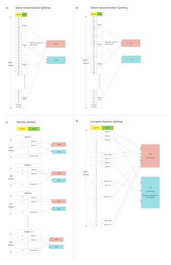

# nitrate-regionalized-model-bavaria

Supplementary material for the paper "Comparison of different data splitting techniques for the development of a  regionalized machine learning model for nitrate concentration prediction in rivers and streams in Bavaria"
