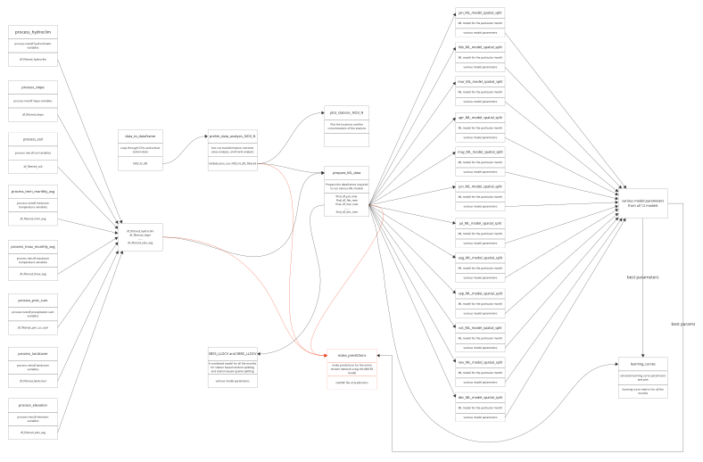

# nitrate-regionalized-model-bavaria

Supplementary material for the paper "Comparison of different data splitting techniques for the development of a  regionalized machine learning model for nitrate concentration prediction in rivers and streams in Bavaria"

The figure above shows the modeling process and how different scripts (Jupyter Notebooks) are connected to each other. The variables in some of the scripts were saved and used as inputs in other scripts.
For every three-part box in the figures, the first part represents the name of the script. The middle part gives a short description of the script, and the bottom part shows the variables from this script that were used in other scripts. The arrows represent which variables were used as inputs to a script and which variables were extracted from that script. 
The modeling process ends with using the Complete Random Splitting (CRS) model to make predictions for the entire stream network using the script defined in the orange box. 
